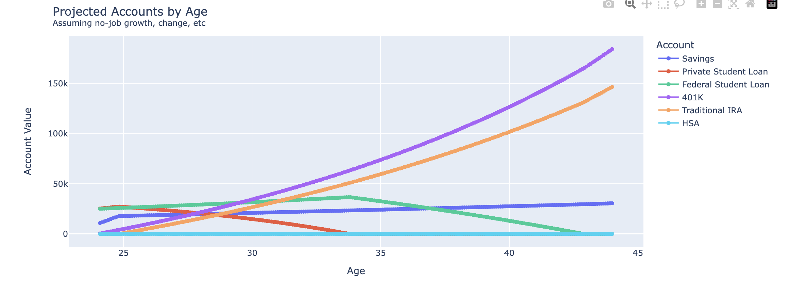
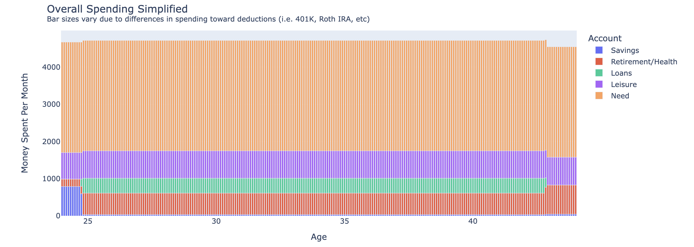
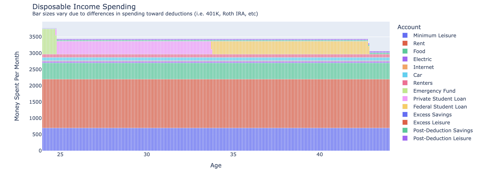
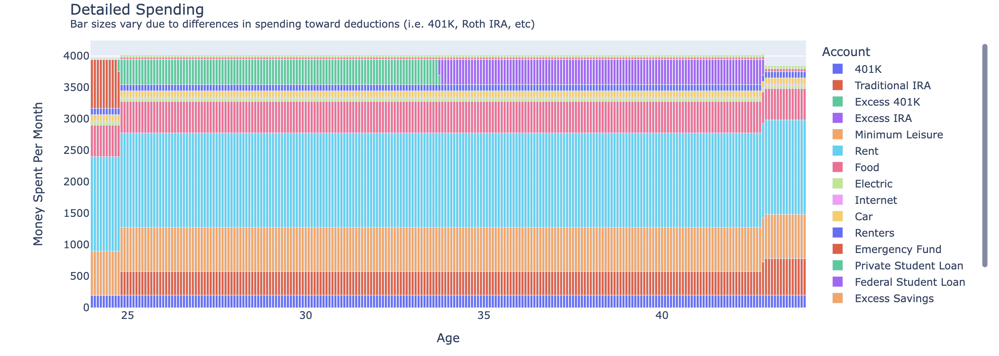

# FinanceCalc
Financial Expenditure Using Modified Step By Step Process from [r/personalfinance](https://www.reddit.com/r/personalfinance/wiki/commontopics/)

## Overview

This finance calculator is designed to help you manage your monthly budget by automating the allocation of your income towards various financial needs and goals. The calculator follows a series of steps to ensure that your essential needs are met first, followed by building an emergency fund, contributing to retirement accounts, paying off high-interest debt, and finally allocating leftover funds towards savings and leisure.

## Usage

1. Edit all information in selections.py to fit your personal financial situation
2. Run all cells in results.ipynb to calculate the proper budget expendatures. Outputs should include all of the below.

## Steps to Decide the Budget Each Month

### Step -1: Non-Decision-Determined Updates
Before making any financial decisions, certain updates occur every month regardless of your choices:

1. **Generate Monthly Net Income Assuming No Deductions**: Will recalculate with proper deductions later and distribute leftover.
2. **Mature Debts and Investments**: All debts and investments mature by one month.

### Step 0: Spend on Determined Needs
The first priority is to spend money on essential needs:

1. **Calculate Total Need Spend**: Sum up the monthly necessity costs for all needs.
2. **Deduct Need Spend**: Deduct the total need spend from your leftover net income.

### Step 1: Build Emergency Fund
Next, ensure that your emergency fund is adequately funded:

1. **Determine Required Emergency Funds**: Calculate the amount needed to complete your emergency fund, which should cover six months of expenses.
2. **Allocate Funds**: If you have high-interest debt and minimal savings, prioritize accordingly. Allocate funds to the emergency fund and distribute equally across short-term savings accounts.

### Step 2: Contribute to Employer Matching Funds
Contribute to employer-matched retirement funds:

1. **Calculate Contribution Amounts**: Determine the feasible contribution amount for each investment object.
2. **Allocate Matching Contributions**: Multiply the feasible amount by two for matching and deduct from leftover income.
3. **Update Matching Amounts**: Update the matching amounts left for each investment type.

### Step 3: Pay Off High-Interest Debt
Pay off high-interest debts:

1. **Determine Contribution Amount**: Calculate the feasible contribution amount for each debt.
2. **Allocate Payments**: Make payments towards the debts and deduct from leftover income.

### Step 4: Contribute to IRA
Contribute to your IRA accounts:

1. **Calculate Contribution Per Account**: Determine the monthly contribution per IRA account.
2. **Allocate Contributions**: Deduct the contribution amount from leftover income and distribute equally among IRAs.

### Step 5: Allocate Savings and Leisure Funds
Distribute any remaining funds between savings and leisure:

1. **Calculate Excess Contributions**: Determine the possible excess contributions to 401K and IRA accounts.
2. **Allocate Leftover Funds**: Split the remaining leftover income between savings and leisure accounts.

### Step 6: Recalulate Leftover Income After Deducting Pre-Tax-Expendatures and Allocate to Additional Savings/Leisure
At the end of each month, perform tasks that occur irrespective of the above steps, such as employer auto-contribution to health plans.

1. **Recalculate Income with Deductions**: Adjust net income by accounting for pre-tax deductions.
2. **Distribute Post-Deduction Leftover**: Split the post-deduction leftover equally between savings and leisure.
3. **Update Records**: Record the financial transactions and update the balances for all accounts.

